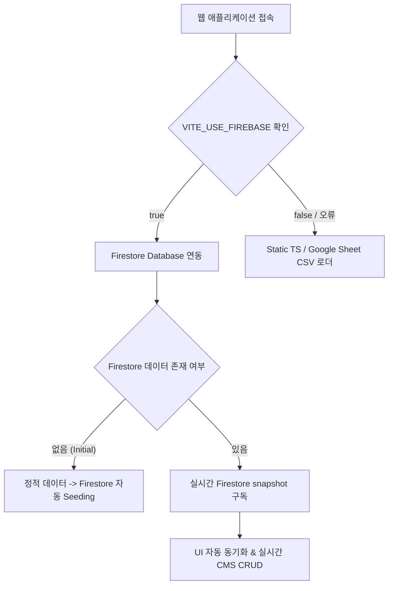

# 📦 URL Index CMS & 데이터 관리 스킬 가이드

본 스킬은 `url-index` 프로젝트의 데이터 레이어, Firebase Firestore 실시간 연동, 사용자 인증(Auth), 구글 시트 CSV 연동 및 시딩 마이그레이션 방식을 다룹니다.

---

## 💡 주요 아키텍처 개요



---

## 1. 📋 데이터 모델 규격 (`src/types/index.ts`)

모든 데이터 구조는 `TableItem` 인터페이스를 준수하며, 진행도는 6단계 전용 수치 타입(`ProgressValue`)으로 관리됩니다.

```typescript
/**
 * 6단계 페이지 진행율 (0%, 20%, 40%, 60%, 80%, 100%)
 */
export type ProgressValue = 0 | 20 | 40 | 60 | 80 | 100;

/**
 * URL Index 대시보드의 단일 페이지 정보 규격
 */
export interface TableItem {
  /** 페이지 제목 (예: "로그인 화면") */
  pageTitle: string;
  /** 고유 페이지 식별자 (예: "FE_SE_0001") */
  id: string;
  /** 1단계 대분류 카테고리 (예: "회원서비스") */
  depth1: string;
  /** 2단계 중분류 카테고리 (예: "로그인") */
  depth2: string;
  /** 3단계 소분류 카테고리 (예: "비밀번호 찾기") */
  depth3: string;
  /** 퍼블리싱 페이지 상대/절대 URL 경로 */
  path: string;
  /** 특정 화면으로 바로 이동하기 위한 대체 목적지 경로 (옵션) */
  filePath?: string;
  /** PC 진행율 (0 ~ 100) */
  progressPc: ProgressValue;
  /** 모바일 진행율 (0 ~ 100) */
  progressMobile: ProgressValue;
  /** 생성일자 (YYYY-MM-DD) */
  createdAt?: string;
  /** 최근 수정/업데이트일자 (YYYY-MM-DD) */
  updatedAt?: string;
  /** 최종 완료 처리일자 (YYYY-MM-DD) */
  completedAt?: string;
  /** 비고 및 특이사항 메모 */
  note?: string;
}
```

---

## 2. 🔥 Firebase 환경 설정 (`src/firebase.ts`)

```typescript
import { initializeApp } from 'firebase/app';
import { getAuth } from 'firebase/auth';
import { getFirestore } from 'firebase/firestore';

// 환경 변수를 통해 Firebase 연동 활성화 여부 제어
export const isFirebaseEnabled = import.meta.env.VITE_USE_FIREBASE === 'true';

const firebaseConfig = {
  apiKey: import.meta.env.VITE_FIREBASE_API_KEY,
  authDomain: import.meta.env.VITE_FIREBASE_AUTH_DOMAIN,
  projectId: import.meta.env.VITE_FIREBASE_PROJECT_ID,
  storageBucket: import.meta.env.VITE_FIREBASE_STORAGE_BUCKET,
  messagingSenderId: import.meta.env.VITE_FIREBASE_MESSAGING_SENDER_ID,
  appId: import.meta.env.VITE_FIREBASE_APP_ID,
};

// 앱 초기화
export const app = initializeApp(firebaseConfig);
export const auth = getAuth(app);
export const db = getFirestore(app);
```

---

## 3. 🔄 실시간 데이터 커스텀 훅 (`src/hooks/useSiteData.ts`)

`useSiteData` 훅은 선택된 사이트(워크스페이스)의 데이터를 관리하며 다음 기능을 순차적으로 처리합니다:

1. **자동 마이그레이션 (Seeding)**:
   - Firestore 서브컬렉션 `sites/{siteKey}/items`에 데이터가 없을 경우 정적 TS 데이터(`tableData.ts` 등)를 Firestore에 자동으로 입력합니다.
2. **실시간 Snapshot 구독**:
   - `onSnapshot`을 통해 다른 사용자가 수정한 데이터가 실시간으로 반영됩니다.
3. **폴백(Fallback) 처리**:
   - Firebase 미설정 시 구글 시트 CSV (`parseSheetCsv.ts`) 또는 로컬 TS 정적 데이터로 자동 전환됩니다.

```typescript
// Firestore 데이터 CRUD 예시 함수 구조
export function useSiteData(currentSite: SiteConfig) {
  // ... 생략 ...

  // 항목 추가 (Create)
  const addItem = async (newItem: TableItem) => {
    if (isFirebaseEnabled && db) {
      const colRef = collection(db, 'sites', currentSite.key, 'items');
      await addDoc(colRef, newItem);
    }
  };

  // 항목 수정 (Update)
  const updateItem = async (itemId: string, updatedFields: Partial<TableItem>) => {
    if (isFirebaseEnabled && db) {
      const itemRef = doc(db, 'sites', currentSite.key, 'items', itemId);
      await updateDoc(itemRef, updatedFields);
    }
  };

  // 항목 삭제 (Delete)
  const deleteItem = async (itemId: string) => {
    if (isFirebaseEnabled && db) {
      const itemRef = doc(db, 'sites', currentSite.key, 'items', itemId);
      await deleteDoc(itemRef);
    }
  };

  return { items, loading, addItem, updateItem, deleteItem };
}
```

---

## 📌 스킬 사용 가이드 요약

- **데이터 변경 시**: 반드시 `useSiteData` 훅을 이용하여 Firestore 및 로컬 상태에 일괄 반영되도록 구현합니다.
- **새 사이트 추가 시**: `src/data/sites.ts` 파일의 `SITES` 배열에 새 사이트 설정(`SiteConfig`)을 추가하면 자동으로 Firestore 컬렉션 구조가 연동됩니다.
