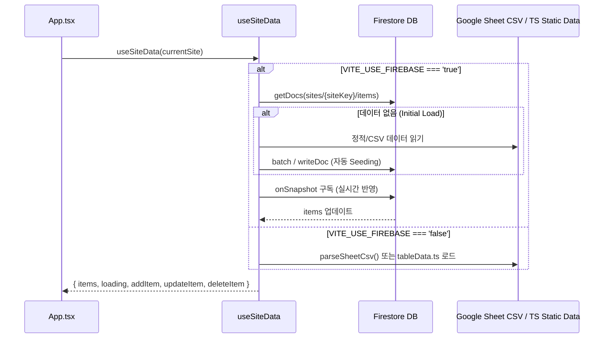

# 🔄 `src/hooks/useSiteData.ts` 파일 스킬 가이드

`src/hooks/useSiteData.ts`는 URL Index 대시보드의 데이터 주 소스(Single Source of Truth)를 다루는 핵심 훅입니다.

---

## 📌 주요 담당 파일
- **핵심 소스**: `src/hooks/useSiteData.ts`
- **연동 모듈**: `src/firebase.ts`, `src/data/parseSheetCsv.ts`, `src/data/sites.ts`

---

## 💡 동작 메커니즘



---

## 💻 CRUD 코드 가이드

```typescript
// 1. 항목 추가 (Create)
const addItem = async (newItem: TableItem) => {
  if (isFirebaseEnabled && db) {
    const colRef = collection(db, 'sites', currentSite.key, 'items');
    await addDoc(colRef, {
      ...newItem,
      createdAt: new Date().toISOString().split('T')[0],
      updatedAt: new Date().toISOString().split('T')[0],
    });
  } else {
    setLocalItems((prev) => [newItem, ...prev]);
  }
};

// 2. 항목 수정 (Update)
const updateItem = async (id: string, fields: Partial<TableItem>) => {
  if (isFirebaseEnabled && db) {
    const docRef = doc(db, 'sites', currentSite.key, 'items', id);
    await updateDoc(docRef, {
      ...fields,
      updatedAt: new Date().toISOString().split('T')[0],
    });
  }
};

// 3. 항목 삭제 (Delete)
const deleteItem = async (id: string) => {
  if (isFirebaseEnabled && db) {
    const docRef = doc(db, 'sites', currentSite.key, 'items', id);
    await deleteDoc(docRef);
  }
};
```

---

## 📌 수정 시 주의사항
- `SiteConfig.key`가 변경될 경우 Firestore의 서브컬렉션 경로가 달라집니다 (`sites/{key}/items`).
- 시딩(Seeding) 시 중복 입력을 방지하기 위해 `docs.empty` 여부를 반드시 확인해야 합니다.
